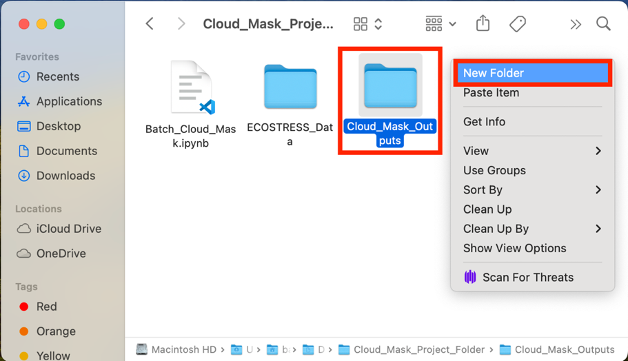
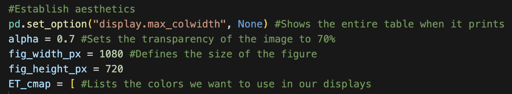
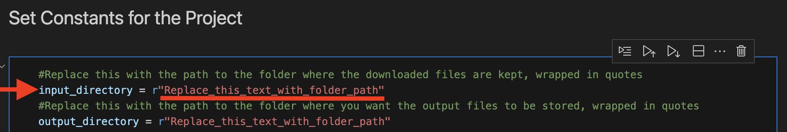
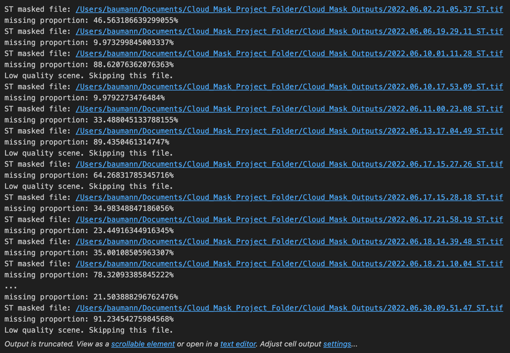

> *This tutorial will show you how to use a code to apply cloud masks to
> ECOSTRESS data products. This code shows an example of applying cloud
> masks to Land Surface Temperature (LST) products, but it can be
> modified for other ECOSTRESS products.*

# Table of Contents

[What is a Cloud Mask?](#what-is-a-cloud-mask)

[Applying a Cloud Mask to a Batch of Images](#applying-a-cloud-mask-to-a-batch-of-images)

# What is a Cloud Mask?

A cloud mask is an image used to help determine if there is cloud
presence in remotely sensed imagery. The mask is binary, meaning it
either indicates the presence of a cloud or it does not. If it does
indicate the presence of a cloud, that pixel can be removed from the
remotely sensed image to improve the accuracy of the overall image.

**Tip**: Make sure you have **Cloud Mask files** downloaded in addition
to your ECOSTRESS product files. If you do not know how to download
these files, see the **Downloading from AppEEARS** tutorial.

## Applying a Cloud Mask to a Batch of Images

1.  Download the **Batch_Cloud_Mask** code from the
    <https://github.com/ECOSTRESS-Tutorials/ECOSTRESS-Batch-Cloud-Mask>.

2.  Open your **finder**. Create a **project folder** to store all the
    files for this project by **right clicking** and selecting **New
    Folder**. Name your new folder so that you know it is the main
    project folder.

3.  **Move** the **downloaded code** file into the project folder.

4.  **Move** the folder with your **downloaded ECOSTRESS data** into the
    project folder.

5.  Open the project folder and create a new **sub folder** to store the
    completed cloud masked file. To do this, go inside the project
    folder, **right click**, and select **New Folder**. Then name the
    folder so that you know it is for the **outputs**.

6.  Open **Visual Studio Code** and use **File \> Open Folder…** to get
    connected to the main project folder that contains the downloaded
    ECOSTRESS files, the Batch_Cloud_Mask code, and the output
    subfolder.

|  |  |
|----|----|

7.  In the **EXPLORER** tab, find the **Batch_Cloud_Mask** code and
    **click** on it to open it.

>  style="width:4.55762in;height:2.75064in"
> alt="Graphical user interface, text, application Description automatically generated" />

**Tip**: If you want to know more about what each line of the code does,
read the **comments** in the code. Comments in the code are identified
by **\#**. These comments do not actually change how the code runs, but
they can be helpful to put notes on how the code works for yourself or
other users. This can also be helpful if you want to customize the code
because it will guide you to which parts you may want to change!

**Examples** of comments (**green text following the \#):**

8.  Then, find the section of the code titled **Set Constants for the
    Project**. Find the variable called **input_directory**. Change the
    text that says **"Replace_this_text_with_folder_path"** to the path
    of the main folder where your ECOSTRESS files are stored.

1.  To **copy the folder path**, use the **EXPLORER** panel on the left
    side of Visual Studio Code to find the folder you are interested in.
    Once you have found it, **right click** on it and select **Copy
    Path**. Now you can paste the path into your code. Make sure it is
    still **wrapped in quotes** and has **r** outside the first quote.

9.  Then, find the variable called **output directory**. Change the text
    that says **"Replace_this_text_with_folder_path"** to the path of
    the folder where you want the output files to be stored. Make sure
    it is still **wrapped in quotes** and has **r** outside the first
    quote.

**Example Directory Set-up:**

10. Now the code should be set up to be run with your images. Scroll
    back to the top to the section titled **Import the Libraries we Need
    to Apply the Cloud Mask**. This is the first block of code we want
    to run. Click into the box with the library importing code and press
    **Shift+Return** to run it.

11. At the top of the window, a pop up will appear prompting you to
    **select a kernel** to run your code with. Click on **Python
    Environments …**

12. Select the **ECOSTRESS** environment that you created, or another
    one if you have a different one you want to use.

**Tip**: If you do not have an ECOSTRESS environment set up, follow the
**Creating an Environment** tutorial to make one.

13. Let the code run for a few seconds. You will see the **seconds
    counting up** in the bottom left of the cell. You will know it is
    done when a **green check mark** appears.

14. Continue this process of running each block of code, in order from
    top to bottom, by clicking into the module with the code and
    pressing **Shift+Return**.

    1.  The **Collect File Names** section of the code will return a
        table with the date and time of the image, LST image file path,
        the associated Cloud Mask file path, and the output file path
        that the masked image will be saved to.

**Example:**

2.  The **Apply the Cloud Mask to the LST Image** section of the code
    will return the name of the masked file and its missing proportion.
    If the missing proportion is too high, it will give you a message
    saying **“Low quality scene. Skipping this file.”** and that file
    will not be saved to the output folder.

**Example:**

15. Once your code has run, check your **outputs** folder to make sure
    the files have been saved there correctly.

**Tip**: **\*Read if you do not want to skip files OR you used a polygon
shapefile\***

If you used a **non-rectangular** polygon shapefile instead of a
rectangle selection or shapefile to download ECOSTRESS data, you will
need to **adjust your code** so that it does not skip all of your
images. Part of the code filters for **high quality** images by skipping
files that have more than **50%** of the pixels missing. However, when
your image is clipped to the shapefile you uploaded, it treats the
surrounding area as **missing pixels**. This will cause your code to
flag all of your images as having a high proportion of missing pixels,
and thus they will **not** be saved. Alternatively, you may want to
**keep all your images**, regardless of their missing proportions. To
fix this, look in the **Apply the Cloud Mask to the LST Image** section,
and find this part of the code:

Highlight that section of the code and press **Command+/** to comment it
out. This means it will be ignored when the rest of the code runs. You
will know you have commented it out when it looks like this:

Then you can proceed with the code as normal!

You have now cloud masked a batch of ECOSTRESS images!
